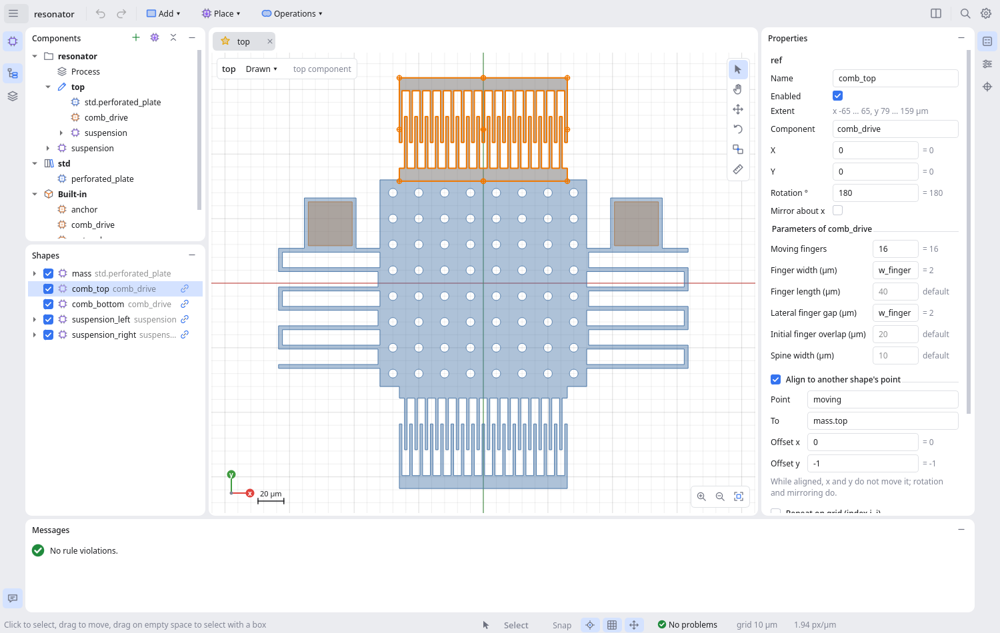

# mems-sketch

Parametric MEMS layout design in Python. Everything is a component: a design
is built from parametric components whose values can be expressions over
parameters and process constants. The tool applies etch-loss compensation,
checks design rules, and exports through pluggable format modules. Simulation
is out of scope.



## Install and run

```bash
pip install -e ".[gui]"                        # or ".[dev]" for tests and linting
mems-sketch examples/resonator/project.yaml    # the GUI (or: python -m mems_sketch.gui)
mems-sketch-cli check examples/resonator       # the same compiler, from the command line
```

## Architecture

```
  project folder (YAML)  ──►  backend = compiler  ──►  geometry, rule checks, exports
  source of truth, in git      mems_sketch.core …            │
          ▲                          ▲                        ▼
          └──── edits ──── frontends: GUI (mems_sketch.gui), CLI, Python scripts
```

- **Source:** a project folder of YAML files (see below). It is small,
  readable, and gives meaningful git diffs.
- **Backend:** reads a project, resolves parameters, builds geometry, applies
  etch loss, checks rules and exports. It has no GUI dependency, which CI
  enforces (`tests/test_architecture.py`).
- **Compiler cache:** every component build is keyed by a fingerprint of
  everything it depends on (definition, referenced components, parameter
  values, process constants). Identical instances are built once, and after an
  edit only the changed components and the components that contain them are
  rebuilt. The cache is in memory; the keys are designed so that it can later
  be persisted, e.g. in SQLite, for large layouts.
- **Frontends:** the GUI edits through the backend's API and displays compiled
  results. The CLI and Python scripts work on the same project files.
- **Editing:** `mems_sketch.editing` is how every frontend changes a project:
  an `EditSession` with undo, and command groups for components, shapes,
  moves, points, parameters and the process. The GUI is one user; a script
  is another:

  ```python
  from mems_sketch.editing import EditSession

  session = EditSession.open_project("examples/resonator")
  session.set_active("suspension")
  session.components.make([((0, 0),), ((0, 1),)], "spring_with_anchor")
  session.save()
  ```

## Projects

```
my_project/
  project.yaml        format, name, top component (null for a library), libraries
  process.yaml        layers (GDS numbers, undercut, rules) and process constants
  components/
    top.yaml          one file per component; the design itself is the top component
    suspension.yaml
```

Files are always written the same way: default values are left out, keys stay
in a fixed order, and unchanged files are not rewritten. Changing one value
changes one line. See `examples/resonator` and the library it uses,
`examples/libraries/mems_std`.

### Everything is a component

- A component has **parameters** (with defaults, limits and optional integer
  constraint) and a **shape tree**. A default may be an expression over other
  parameters, e.g. `hole_r` defaulting to `pitch / 6`.
- The design is the **top** component. Its parameters play the role of global
  variables, so any project can be placed inside another one.
- Values passed to a component are evaluated in the caller's scope. Parameters
  left out fall back to their defaults.
- **Process constants** from `process.yaml` are available in every expression
  as `process.<name>`, so process values do not have to be passed down.

### Alignment points

Instead of calculating positions by hand, place shapes relative to each other:

```yaml
- kind: ref
  name: anchor
  component: anchor
  align: {point: bottom, to: spring.end, dy: -1}   # sit on the spring, 1 µm overlap
```

- **Every shape** has bounding-box points: `center`, `left`, `right`, `top`,
  `bottom`, `top_left`, `top_right`, `bottom_left`, `bottom_right`.
- **Components can declare points** (the Points panel, or `points:` in the
  component file), e.g. where a spring ends. A point's position may be
  measured from one of the component's own shapes (`at: spring.end`), which is
  how a component passes on a point of a part inside it. Built-ins have some:
  `serpentine_spring` has `start` and `end`, `comb_drive` has `moving` and
  `fixed` (the outer edge of each spine).
- **`align`** moves a shape so that its `point` lands on `to` (plus `dx`,
  `dy`). It is a rule, not a one-off move: it is re-evaluated after every
  change, so the parts stay attached when parameters change.
- **In expressions**, point coordinates are available as `<shape>.<point>.x`
  and `.y`, e.g. `x1: base.right.x - 5`.
- A shape can use the points of the named shapes in its own list, in the other
  operand of a boolean, and in every enclosing list. Inside a transform they
  are seen in the transform's own coordinates. Shapes are evaluated in the
  order their alignments need; an alignment loop is reported as an error.

### Libraries

A library is a folder of components (any project folder works), listed in
`project.yaml`:

```yaml
libraries:
  std: ../libraries/mems_std
```

Its components are placed as `std.perforated_plate`. Libraries are read-only
and self-contained: inside a library, bare names refer to that library's own
components (then built-ins), never to the project's.

A project without a top component (`top: null` in `project.yaml`) is a
library: just components, meant to be placed elsewhere
(`mems-sketch-cli new --library`, **File → New library**, or **Make the
project a library** in the Components explorer). To change a library
component for one project, copy it into the project (**Copy into the
project**): the copy is editable and keeps using the library's other
components.

## Command line

```bash
mems-sketch-cli new     my_project [--library]
mems-sketch-cli info    my_project
mems-sketch-cli check   my_project [--component NAME] [--set pitch=15] [--etch etched] [--json]
mems-sketch-cli export  my_project out.gds [--etch compensated] [--set pitch=15]
mems-sketch-cli convert old_design.mems my_project     # import the earlier SQLite format
```

`check` exits with status 1 when there are rule violations, so it can gate CI.
Errors exit with status 2. `--set` accepts numbers or expressions and can be
repeated, which is convenient for parameter sweeps and for calling from
MATLAB with `system(...)`.

## GUI

The window follows JetBrains IDEs for the editor parts (one toolbar row,
tool windows opened from stripes, tabs, settings, Find Action) and
Blender/Unity for the geometry (canvas modes, gizmos, coloured axes). Icons
are small SVG drawings coloured for the light or dark theme (`gui/icons.py`).
Every menu is under **☰** at the left of the toolbar; the menu paths below
(e.g. **View → Dark canvas**) are inside it.

- **Look**: a light and a dark theme (**File → Settings… → Appearance**, or
  follow the system). The canvas follows the interface or keeps its own light
  or dark background (**View → Dark canvas**).
- **Settings** (Ctrl+Alt+S): appearance, canvas (fill opacity, outlines, grid
  density, overlays, gizmo size, zoom step), snapping (points, grid, distance,
  rotation step), editor (restore state, default path width) and a keymap
  list. A search field filters them; changes apply at once and are kept per
  user.
- **Find Action** (Ctrl+Shift+A, the magnifier in the toolbar): type part of a
  command's name, Enter runs it.
- **Toolbar** (one row): ☰, the project, undo and redo, then **Add ▾**
  (primitives: rectangle, circle, polygon and path start their drawing tool,
  an arc is added as a default one), **Place ▾** (components) and
  **Operations ▾**; on the right split view, Find Action and settings. New,
  open, save and export are in **☰ → File** (Ctrl+N, Ctrl+O, Ctrl+S).
- **Tool windows**, opened and closed from the stripes on the window edges,
  as in IntelliJ: on the left stripe Components at the top, then Shapes and
  Layers, and Messages (the bottom panel) at the bottom; on the right stripe
  Properties, Parameters and Points. Each place shows one window at a time;
  the left side splits when Components and Shapes (or Layers) are both open.
  Every panel and the editor is an *island*, a rounded panel on the window's
  frame (as in JetBrains' Islands theme); Messages runs the full width at the
  bottom. A panel's header lines up with the editor tabs and carries the
  panel's own buttons. Which windows are open and their sizes are remembered. **View →
  Panels** lists them too.
- **Status bar**: the current hint, the active tool and its options (the
  drawing layer and path width while drawing, the angle step for Rotate), the
  snapping toggles (shape points, grid) and the gizmo toggle, then problems
  (click to open Messages), grid step, zoom and cursor position.
- **Tabs**: every component opens in its own tab, with its own zoom, selection
  and view mode; the panels show the current tab. Double-click a component in
  the Components panel, or a placed component in the canvas or the Shapes
  tree, to open it. Library and built-in components open read-only. **View →
  Split view** (Ctrl+\\) shows two tabs side by side: edit a spring on one side
  and watch the resonator that uses it on the other. A `*` on a tab marks a
  component changed since the last save. Tabs show whether a component is the
  top one (star) or read-only (lock); right-click a tab to close it, the
  others or all, or to open it in the other pane.
- **Editor state**: how the project was being looked at comes back when it is
  reopened: open tabs and the split, zoom and position per tab, view modes,
  selections, rulers, collapsed tree items, hidden layers, trial values, and
  the drawing layer and path width. It is kept in `.mems-sketch/state.json` in
  the project folder, which carries its own `.gitignore`, so it moves with the
  project but never reaches git.
  Deleting the folder resets the views. Window layout, settings and the
  active tool are per user.
- **Undo/redo** is one history for the whole project and goes back to the tab
  where the change was made, reopening it if it was closed.
- **Components** (an explorer): the project, each library and the built-ins,
  with their own icons (purple project components, blue library ones, orange
  built-ins; a star for the top component). These are definitions: every
  component expands to the components it uses, and those expand in turn
  (hover one to see where it is placed). The placements themselves, each with
  its own name, are in the Shapes list. Double-click opens a component in a tab; drag one onto the canvas, or
  use **Place**, to put it into the component being edited. Right-click for
  the rest: open in the other pane, rename (updates every reference and tab),
  duplicate, delete, set as top, copy a library component into the project,
  new component, add or remove a library, make the project a library. The +
  button adds a component or a library.
- **Shapes**: the shapes of the component being edited, one line each: the
  name, then briefly what it is (the layer of a primitive, the component a
  reference places, `3×2` when repeated) in grey; a link icon marks an aligned
  shape (hover it for e.g. `bottom at spring.end`). Checkboxes enable or
  disable a node; Ctrl/Shift-click selects several. Operations show their
  operands under them (booleans under A and B). A placed component expands to
  show what is inside it, in grey italics: that belongs to the component's
  definition, so it is read-only here (changing it would change every copy).
  Double-click such a row to open the component with that shape selected.
- **Canvas**: wheel to zoom, middle or right drag (or Space + drag, in any
  tool) to pan, F to fit; the buttons in the bottom-right corner zoom and fit
  too, and the **canvas modes** (Select, Hand, Move, Rotate, Align, Measure)
  float in the top-right corner. The selection is outlined in orange with its alignment points, the
  shape under the cursor is outlined dashed (what a click would select), rule
  violations are boxed in red and the component's own points are marked in
  green. The x axis is red and the y axis green; the corner shows an axis
  indicator and a scale bar, and the top left what is shown (component,
  read-only) with the tab's **view mode**: click it to switch between drawn,
  as-etched and etch-compensated geometry. **View → Overlays** switches each
  of these on or off.
- **Right-click** in the canvas (a click; a right drag pans): **Add** a
  primitive with its first point where you clicked, **Place component**, and
  for the selection (the shape under the cursor is selected first) Combine
  (union, subtract, intersect, XOR), offset, fillet, transform, layer map,
  make or unpack component, rotate 90° and mirror, duplicate and delete.
  Entries that do not apply are greyed out. The keyboard's menu key opens it
  too.
- **Properties**: generated from the selected node's schema. Any numeric field
  takes a number or an expression, with its value shown beside it. For a
  component the component's own parameters are listed, with their declared
  defaults as placeholders.
- **Parameters**: the current tab's parameters: default (number or
  expression), min, max, trial and the resolved value. A **trial** value shows
  the component with another value without changing the design: it is not
  saved or undone, and only affects that component's own tab (the components
  that place it still pass their own values). It also works on library and
  built-in components.
- **Points**: the points the edited component declares for whoever places it.
- **Tools** (the canvas modes in the canvas's corner; the drawing tools start
  from **Add**, the right-click menu or their shortcut. A tool stays active
  until another is chosen; Esc cancels what it is doing and, pressed again,
  returns to Select):
  - **Select** (V): click to select (Ctrl/Shift to add), drag the selection to
    move it, drag on empty space to select with a box. A drag snaps to the
    grid, or a point of the moved shapes to another shape's point (Ctrl: no
    snapping); releasing with **Shift** on a snapped point aligns the shape
    there. Shapes aligned to the moved ones move along.
  - **Hand** (H): the left button pans (for trackpads without a middle button).
  - **Move** (M): the selection gets a move gizmo: drag the red arrow to move
    along x, the green one along y, the centre circle freely (grid steps;
    Ctrl: free). Or click a base point, then where it goes; both snap to shape
    points, so parts can be placed exactly. **Edit → Move by…** takes a typed
    dx, dy; the arrow keys nudge by a grid step (Shift: a tenth).
  - **Rotate** (R): drag the ring around the selection to rotate about its
    centre, or click a pivot, then set the angle (15° steps by default; Ctrl:
    free). **Rotate 90°** (Ctrl+R, Ctrl+Shift+R) and **Mirror** left-right or
    up-down (right-click menu, or **Edit**) act about the selection's centre.
  - **Align** (A, Ctrl+L): click a shape, one of its points, then the point to
    put it on. Fine-tune the offset in Properties; **Edit → Remove alignment**
    takes it off and leaves the shape where it is.
  - **Measure** (D): click two points (they snap) to see the distance, dx and
    dy. Rulers stay until **Tools → Clear rulers**; they also work on
    read-only tabs.
  - **Rectangle** (B) and **Circle** (C): drag, or click twice (corner and
    opposite corner; centre and radius). Shift draws a square.
  - **Polygon** (P) and **Path** (W): click the points; a double-click, Enter
    or (for a polygon) a click on the first point finishes, Backspace takes
    back the last point. Shift keeps segments at 0°, 45° or 90°.

  The drawing tools draw on the layer chosen in the status bar (clicking a
  layer in the Layers window also chooses it); paths get the **Width** next
  to it. Points snap to shape points, else to the grid
  (Ctrl: no snapping). A drawn shape is added at the top of the edited
  component with a fresh name, selected, and editable like any other; the
  numbers can be turned into expressions in Properties afterwards.

  Moving and rotating change what a shape stores, always relative to its
  parent: `x`, `y` and `rotation` of a component or transform, the
  coordinates of a primitive, or the offset of an aligned shape (Alt-drag
  removes the alignment instead). Primitives have no rotation of their own,
  so rotating one wraps it in a transform that takes over its name.
  Expressions stay parametric: `plate/2 + 39` moved by 11 becomes
  `plate/2 + 50`. Each move or rotation is one undo step.
- **Layers**: which layers are shown, their colours and GDS numbers.
- **Process** (the first item of the project in Components, or **View →
  Process**): a tab with the process constants, available in every
  expression as `process.<name>`, and the layer definitions: GDS layer and
  datatype, undercut, minimum width and spacing. Edits are undoable like any
  other.
- **Operations** (Operations ▾ or the right-click menu: Union, Subtract,
  Intersect, XOR, Offset, Fillet, Layer map, Transform) wrap the selected
  sibling shapes in a new operation node; **Edit →
  Unwrap** reverses it. **Make component** (Ctrl+K) moves the selection into a
  new component. The parameters it uses become the new component's parameters,
  so the geometry does not change; a single transform becomes a component
  placed where the transform was. **Unpack component** (Ctrl+Shift+K) does the
  opposite: it replaces a reference by a transform holding a copy of the
  component's shapes, with the parameter values filled in.
- Renaming a shape updates the alignments and expressions that use it.
- Every edit is a transaction: if it would stop the project from compiling
  (including components that use the edited one), it is rolled back with a
  message. Full undo/redo.
- **File**: open a project (or a legacy `.mems` file), save to a folder,
  export drawn, as-etched or etch-compensated geometry.

## Shapes and operations

A component's body is a **shape tree** that is re-evaluated whenever a value
changes. Operations are nodes in the tree, not destructive edits, so a
subtraction stays editable and parametric.

| Kind | Node | Notes |
|---|---|---|
| Primitive | `rect`, `polygon`, `circle`, `arc`, `path` | `arc` is an annular sector (a ring at 360°); `path` is a centreline with a width and flush/square/round ends |
| Reference | `ref` (or `Instance(...)`) | A component with parameters and placement |
| Operation | `transform` | Mirror, scale, rotate and move the children as one piece (formerly `group`, still read) |
| | `boolean` | `a` union / subtract / intersect / xor `b` |
| | `offset` | Grow (+) or shrink (−) outlines |
| | `fillet` | Round convex (`radius`) and concave (`inner_radius`) corners |
| | `layer_map` | Move geometry between layers, e.g. derive an anchor layer from a device outline |

- **Booleans, offsets and fillets act per layer.** Subtracting a device-layer
  hole only affects the device layer. To combine different layers, bring them
  onto one layer with `layer_map` first.
- **Any node can carry modifiers**, a stack applied in order as in Blender:

  | Modifier | Makes |
  |---|---|
  | `array` | `columns` × `rows` copies, `dx`, `dy` apart; `i` and `j` are the copy's column and row, so each copy can differ (e.g. `length: 40 + 2*i`) |
  | `polar_array` | `count` copies around a centre `x`, `y`, `step` degrees apart (a full circle by default), turned with the circle or (`rotate: false`) keeping their orientation; `i` is the copy's index |
  | `mirror` | the node and its mirror image across the vertical line at `x` (`axis: x`), the horizontal line at `y` (`axis: y`) or both; or, with `about`, across a guide (`about: centerline`) or through a point (`about: mass.center`, point symmetry); `keep: false` leaves only the image |

  ```yaml
  - kind: ref
    name: comb
    component: comb_drive
    modifiers:
    - {kind: mirror, axis: x, x: mass.center.x}
    - {kind: array, columns: 3, dx: 120}
  ```

  The order matters: mirroring an array is not arraying a mirror. Every value
  can be an expression, including another shape's point (`mass.center.x`).
  `self` is the shape itself just before the modifier: `x: self.left.x`
  mirrors a half across its own left edge, and `x: self.center.x` centres a
  polar array on the shape.
  Modifiers work in the frame of the list holding the node, before its
  alignment moves the result, so a mirror about `mass.center.x` stays put when
  the part is moved and the halves move symmetrically. Each modifier can be
  switched off (`enabled: false`). Editing from code or a frontend goes
  through `session.modifiers` (`add`, `update`, `move`, `set_enabled`,
  `remove`, and `apply`, which bakes the first modifier into real shapes, like
  Blender's Apply). Files that use the earlier `repeat:` field still load: it
  is an array modifier.
- **Guides** (`kind: guide`, two end points) are construction lines: they
  draw nothing and are not exported, but have points (`start`, `end`,
  `center`) and can be aligned like any shape. Mirror across one to keep a
  symmetry axis in the middle of a component:

  ```yaml
  - kind: guide
    name: centerline
    align: {point: center, to: mass.center}   # vertical by default
  - kind: ref
    name: comb
    component: comb_drive
    modifiers:
    - {kind: mirror, about: centerline}
  ```
- **`enabled=False`** skips a node without deleting it.
- **Any node can be aligned** (`align=Align(point, to, dx, dy)`), see
  [Alignment points](#alignment-points).
- **Transform or component?** Make a component when something is reused or
  deserves its own parameters. Use a transform to move, rotate or mirror a few
  shapes together once.
- **Etch loss and rule checks run on the final result**, after all operations.
- Units are micrometres. Coordinates snap to the 1 nm grid, and curves stay
  within 5 nm of the true arc.

## Code-first use

```python
from mems_sketch import (
    Align,
    ComponentDef,
    Instance,
    ParamDef,
    RectShape,
    Repeat,
    load,
    save,
    export,
)
from mems_sketch.process import etch, rules

project = load("examples/resonator")
project.set_variable("pitch", 16)  # a top-level parameter
project.define_component(
    ComponentDef(
        name="finger_array",
        parameters=[
            ParamDef(name="n", default=4, min=1, integer=True),
            ParamDef(name="w", default="process.min_gap"),
        ],
        shapes=[
            RectShape(
                layer="device", x0=0, y0=0, x1="w", y1=30, repeat=Repeat(columns="n", dx="3 * w")
            )
        ],
    )
)
project.add(
    Instance(
        "fingers",
        "finger_array",
        {"n": 12},
        align=Align(point="bottom_left", to="mass.top_right", dx=10),
    )
)

print(rules.check(project))
save(project, "my_resonator")  # a project folder
export(project, "my_resonator.gds", geometry=etch.compensated(project))
```

`examples/build_examples.py` generates the example library and project from
code. MATLAB can use the same API through its Python interface
(`p = py.mems_sketch.load("examples/resonator");`) or call the CLI.

## Package layout

| Module | Contents |
|---|---|
| `core/project.py` | `Project`, `Library`, `Instance`: components, name resolution, parameters |
| `core/compiler.py` | `Compiler` and `Session`: fingerprints, cache, rendering |
| `core/shapes/` | The shape tree: one module per shape kind in `kinds/`, their registry, alignment points, evaluation, rewriting |
| `core/user_component.py` | `ComponentDef`, `ParamDef` and their adapter to `Component` |
| `core/component.py` | `Component` base class, `Geometry`, built-in component registry |
| `core/process.py` | `Process`, `Layer`, process constants |
| `core/expressions.py` | Safe arithmetic expressions with dependency resolution |
| `components/library.py` | Built-ins: `rectangle`, `anchor`, `comb_drive`, `serpentine_spring` |
| `process/etch.py`, `process/rules.py` | Etch loss (predict / compensate) and design-rule checks |
| `storage/` | Project folders (canonical YAML) and the legacy SQLite importer |
| `export/` | Exporter plugins: GDSII, OASIS, DXF |
| `cli.py` | `mems-sketch-cli` |
| `editing/` | `EditSession`: transactions, undo, files, and the edit commands (components, shapes, moves, points, parameters, process) |
| `gui/` | PySide6 frontend: the window (actions and menus, toolbar, tool windows, status bar), tabs, canvas and tools, panels, the Process tab, property editor, editor state, settings, theme and icons |

## Extending

**New built-in component:** subclass `Component`, define a nested `Params`
model and `build()`, and decorate the class with `@register_component`.
Override `points()` to offer alignment points.

**New shape kind:** write a module in `core/shapes/kinds/` with a `Node`
subclass (`Primitive` or `Operation` for the usual defaults) that implements
`render` and, as needed, `moved`, `placement`, `summary`, `default` or `wrap`,
and add the class to `KINDS` in `kinds/__init__.py`. `tests/test_shape_kinds.py`
then checks it (YAML round trip, rendering, moving); the GUI's shape tree and
property panel pick it up without changes.

**New edit command:** a method on one of the command groups in `editing/`
(`components.py`, `nodes.py`, `moves.py`, ...) that calls `self.session.edit`
with a description and a change; it gets undo and rollback, and is usable from
scripts at once. To offer it in the GUI, add an action in `gui/actions.py` and
put it in a menu, the toolbar or the right-click menu.

**New tool window:** `window.tool_windows.add(name, title, icon, widget,
anchor)` in `MainWindow._build_tool_windows`, with an anchor of `left-top`,
`left-bottom`, `bottom` or `right`.

**New export format:** write a class with `format_name`, `file_extension` and
`export(project, geometry, path)`. Register it either with `@register_exporter`
or, from a separate package, under the `mems_sketch.exporters` entry-point group:

```toml
[project.entry-points."mems_sketch.exporters"]
svg = "my_package.svg:SvgExporter"
```
