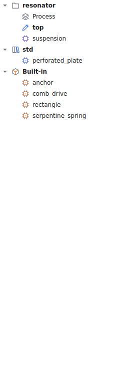
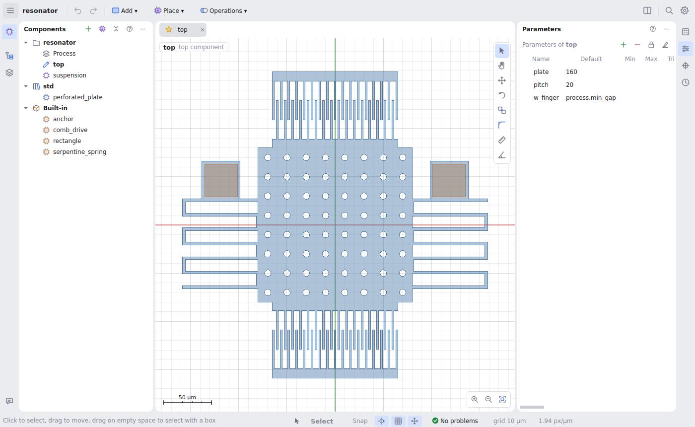
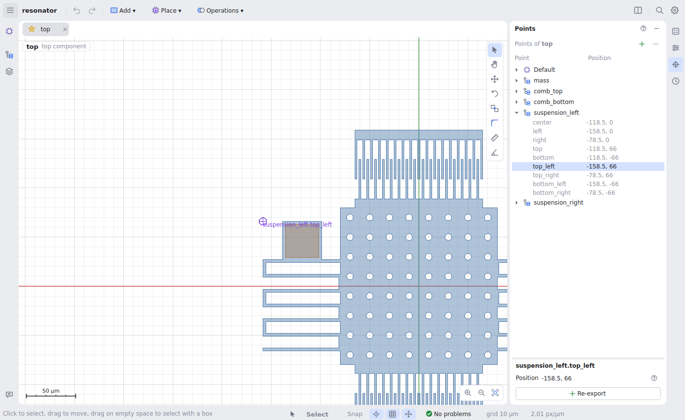
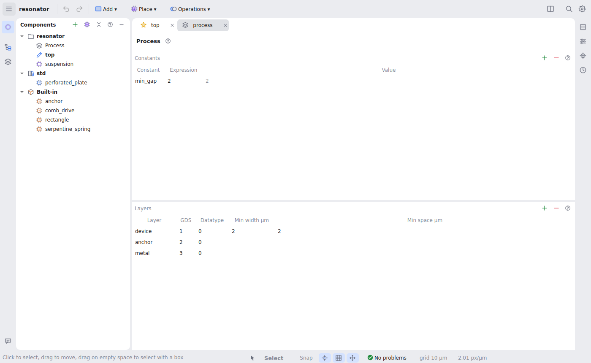

# Components, parameters and points

## Everything is a component

A component has **parameters** and a **shape tree** (what it is made of, see
[shapes](shapes-and-operations.md)). The design itself is the **top**
component: its parameters play the role of global variables, so any project
can be placed inside another one.



The **Components** panel lists every component once:

- **the project's own** (purple; a star marks the top one), with **Process**
  first;
- **each library's** (blue), read-only;
- **Imported** layouts, if any (see [files](files.md#importing-layouts));
- **Built-in** ones (orange): `rectangle`, `anchor`, `comb_drive`,
  `serpentine_spring`.

Double-click opens a component in a tab. Drag one onto the canvas, or use
**Place**, to put it into the component you are editing. Right-click for the
rest: rename (every reference follows), duplicate, delete, set as top, new
private component, make shared or private, copy a library component into the
project, add or remove a library, make the project a library. The **+**
button adds a component or a library.

### Shared and private components

A component is **shared** or **private** to another one, like a nested class:
`comb/finger` is `finger`, made for `comb` and placed only inside it. It is
listed under its owner. This says what belongs to what, not where things are
used; hover a component to see what it places and where it is placed. **Make
component** (Ctrl+K) on a selection makes a private component of the one you
are editing.

## Parameters



The **Parameters** panel lists the current component's parameters: default,
min, max, a trial value and the resolved value.

- A **default** is a number or an expression over other parameters
  (`hole_r` defaulting to `pitch / 6`) and process constants
  (`process.min_gap`).
- **Min**, **max** and *integer* limit what can be passed in.
- A parameter is **public** (whoever places the component can set it) or
  **internal** (the lock button): used only inside, typically a derived value.
  Where the component is placed, internal parameters are not offered.
- A **trial** value shows the component with another value without changing
  the design: it is not saved or undone and only affects that component's own
  tab. It also works on library and built-in components, so you can try a
  spring with more turns before using it.
- Values passed to a placed component are evaluated where it is placed;
  parameters left out take their defaults.

**Make a parameter from a value:** in Properties, the parameter button beside
any number field (on hover) makes a new parameter with that value as default
and uses it.

## Points

Instead of calculating positions, place things relative to each other's
**points**:

- **Every shape** has the points of the box around it: `center`, `left`,
  `right`, `top`, `bottom`, `top_left`, `top_right`, `bottom_left`,
  `bottom_right`.
- **A component can declare points** for whoever places it: where a spring
  ends, where a comb's moving spine is. Built-ins have some (`serpentine_spring`
  has `start` and `end`; `comb_drive` has `moving` and `fixed`).
- **In expressions**, a point's coordinates are `<shape>.<point>.x` and `.y`,
  e.g. `base.right.x - 5`.



The **Points** panel lists them as objects: first the component's own points
(editable), then **Default** (the box around the whole component), then the
points of each named shape. Hover a point to see it on the canvas; click it to
pan there and edit it in the form below. **Re-export** turns a shape's point
into a point of this component, measured from the original, so it follows
it: that is how a component passes on a point of a part inside it. Renaming a
point updates everything that uses it.

Points are drawn on the canvas only while you work with them: with the Points
panel open, or while aligning (**View → Overlays → Always show points** to
see them all the time).

## Libraries

A library is a folder of components (any project folder works), added from
the Components panel's **+** or listed in `project.yaml`:

```yaml
libraries:
  std: ../libraries/mems_std
```

Its components are placed as `std.perforated_plate`. Libraries are read-only:
to change a library component for one project, right-click it and **Copy into
the project**; the copy is editable and keeps using the library's other
components.

A project without a top component is itself a library: just components, meant
to be placed elsewhere (**File → New library**, or **Make the project a
library** in the Components panel).

## The process

**Process** (the first item under the project in Components, or **View →
Process**) is a tab with the process constants, available in every expression
as `process.<name>`, and the layers: their GDS layer and datatype, and the
minimum width and spacing that the design-rule check uses.



The rule check runs on the final geometry after every change; **Messages**
lists what is too narrow or too close, and the canvas boxes it in red.
