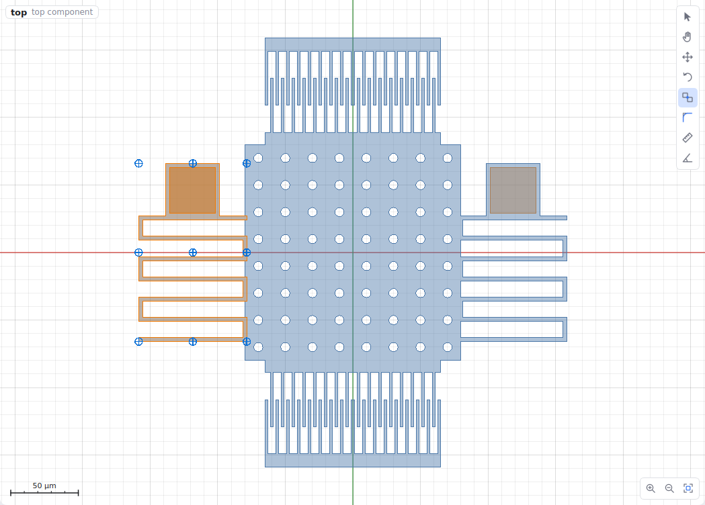
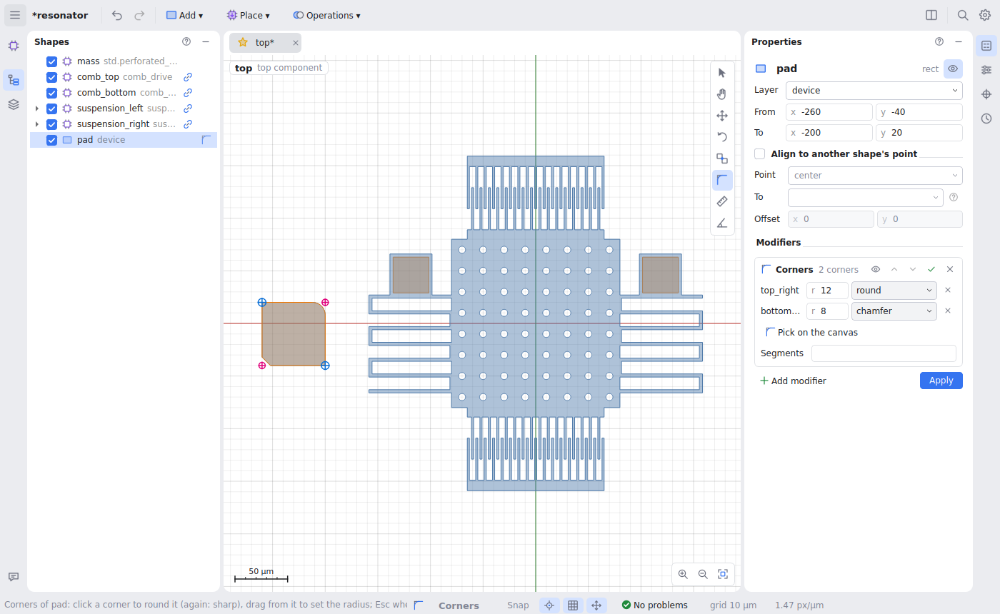

# Drawing and editing

## The canvas

- **Zoom** with the wheel; **pan** with the middle or right button, or Space +
  drag in any tool; **F** fits the design. The buttons in the bottom-right
  corner zoom and fit too.
- The **canvas modes** float in the top-right corner: Select, Hand, Move,
  Rotate, Align, Corners, Measure, Angle.
- The selection is outlined in orange; the shape under the cursor is outlined
  dashed (what a click would select); rule violations are boxed in red.
- The x axis is red and the y axis green; a scale bar sits in the corner, and
  the top left says what is shown. **View → Overlays** switches each of these
  on or off.
- **Right-click** (a click; a right drag pans) for **Add** (a primitive
  starting where you clicked), **Place component**, and for the selection:
  combine, offset, fillet, transform, layer map, make or unpack component,
  rotate 90°, mirror, duplicate and delete.

## Tools

A tool stays active until another is chosen; **Esc** cancels what it is doing
and, pressed again, returns to Select.

| Tool | Key | What it does |
|---|---|---|
| **Select** | V | Click to select (Ctrl/Shift adds), drag the selection to move it, drag on empty space for a box. A drag snaps a point of the moved shapes to another shape's point, else to the grid (Ctrl: no snapping); release with **Shift** on a snapped point to *align* there. |
| **Hand** | H | The left button pans (for trackpads). |
| **Move** | M | A gizmo: drag the red arrow along x, the green along y, the centre freely. Or click a base point, then where it goes. **Edit → Move by…** takes a typed dx, dy; arrow keys nudge by a grid step (Shift: a tenth). |
| **Rotate** | R | Drag the ring around the selection, or click a pivot then set the angle (15° steps; Ctrl: free). **Rotate 90°** is Ctrl+R / Ctrl+Shift+R; **Mirror** is in the right-click menu. |
| **Align** | A | Click a shape, one of its points, then the point to put it on (below). |
| **Corners** | O | Round or chamfer single corners (below). |
| **Measure** | D | Click two points (they snap) for the distance, dx and dy. Rulers stay until **Tools → Clear rulers**. |
| **Measure angle** | N | Click the vertex, then a point on each arm; the angle stays like a ruler. |
| **Rectangle**, **Circle** | B, C | Drag, or click corner and opposite corner (centre and radius). Shift: a square. |
| **Polygon**, **Path** | P, W | Click the points; double-click, Enter or (polygon) the first point finishes; Backspace takes back a point. Shift: 0°, 45°, 90° segments. |
| **Guide** | G | A construction line: draws nothing, but has points and can be mirrored about. |

The drawing tools draw on the layer chosen in the status bar (or by clicking a
layer in **Layers**); paths use the **Width** beside it. A drawn shape gets a
fresh name and is selected; its numbers can become expressions in Properties
afterwards.

**Moving keeps things parametric.** A move changes what the shape stores,
relative to its parent: `plate/2 + 39` moved by 11 becomes `plate/2 + 50`.
An aligned shape keeps its alignment and changes its offset (Alt-drag removes
the alignment instead). Primitives have no rotation of their own, so rotating
one wraps it in a transform.

## Aligning parts

**Align** moves a shape so that one of its points lands on another shape's
point, plus an offset. It is a rule, not a one-off move: it is re-evaluated
after every change, so parts stay attached when parameters change.

1. Choose **Align** (A) and click the shape to move: its points are marked.
2. Click the point to align by, then the point to put it on.
3. Fine-tune the offset (e.g. 1 µm overlap) in **Properties**. **Edit →
   Remove alignment** takes it off and leaves the shape where it is.

In **Shapes**, a link icon marks an aligned shape; hover it for e.g. `bottom
at spring.end`.

## Rounding single corners

**Corners** (O) rounds or chamfers the corners you pick, each with its own
radius, where a fillet would round all of them:

1. Click a shape; its corners are marked (the small steps of curves are not
   corners).
2. Click a corner to round it with the last radius used; click it again to
   make it sharp. Drag away from a corner to set its radius, drawn as you drag.
3. In **Properties**, the shape's **Corners** card lists each corner's radius
   and style (round or chamfer).

A corner is recorded so that it follows the design: as the shape's own point
(`top_right`), a neighbour's point, or the expressions the shape is written
with (`slot_x` for a corner a cut made). It works on a placed library part
too: the rounding belongs to the placement, not to the library.

## Properties

The selected shape's fields. The name is the title (click to rename), with an
eye beside it that switches the shape off or on.

- **Any number field takes a number or an expression.** An expression is
  tinted and shows its value; a red border means it cannot be evaluated.
  Typing offers the matching parameters, process constants and points.
- **Drag a number** left or right to change it, as in Blender (Shift: finer,
  Ctrl: round steps; counts go in whole numbers). The canvas follows live and
  the change is one undo step. A click without dragging edits the text.
- For a placed component, its parameters are listed with their defaults as
  placeholders.
- **Modifiers** are cards (array, polar array, mirror, corners): switch one
  on or off, reorder, apply or remove it. See
  [modifiers](shapes-and-operations.md#modifiers).

## Shapes and Layers panels

**Shapes** lists the shapes of the component being edited, one line each: the
name, then what it is in grey (a primitive's layer, the component a reference
places). Checkboxes switch shapes off without deleting them; operations show
their operands under them. A placed component expands to show what is inside
it, read-only (changing it would change every copy); double-click such a row
to open the component with that shape selected.

**Layers** shows which layers are visible, their colours and GDS numbers;
clicking one makes it the drawing layer.
