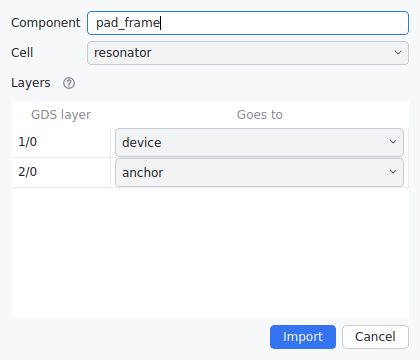

# Files, import and export

## The project folder

A project is a folder of small text files, meant to live in git:

```
my_project/
  project.yaml        name, top component, libraries, imported layouts
  process.yaml        layers (GDS numbers, rules) and process constants
  components/
    top.yaml          one file per component; the design is the top component
    comb.yaml
    comb/
      finger.yaml     a component private to comb
  imports/
    padframe.gds      a copy of each imported layout
```

Files are always written the same way: values equal to their default are left
out, keys keep a fixed order, and unchanged files are not rewritten. Changing
one value changes one line. See `examples/resonator` and the library it uses,
`examples/libraries/mems_std`.

**File** (in **☰**): New (Ctrl+N), New library, Open (Ctrl+O), Save (Ctrl+S)
and Save as. Open also takes a one-file project or a legacy `.mems` design;
those open as a copy, which **Save as** stores as a folder.

## Exporting

**File → Export…** (Ctrl+E) writes the component in the current tab, as
drawn (with its trial values):

| Format | For |
|---|---|
| GDSII (`.gds`), OASIS (`.oas`), DXF (`.dxf`) | Mask and layout tools; layers get their GDS numbers from the process |
| Geometry as JSON (`.json`), XML (`.xml`), MATLAB (`.mat`) | Scripts: the polygons, plus the component's points and parameter values |

A geometry file holds, per layer, the polygons as rows of `x y` points in µm,
each with its holes; then the points and parameters. In MATLAB:

```matlab
s = load('comb.mat');
s.layers.device.polygons{1}.hull    % N×2, µm; holes in .holes
s.points.tip                        % .x, .y
s.parameters.pitch
```

`.mat` files need `pip install 'mems-sketch[matlab]'`. They are written in
the format MATLAB's `load` reads by default; files saved with `-v7.3` cannot
be read.

## Importing layouts

**File → Import…** (Ctrl+I) makes a layout into a read-only component:

- **one cell of a GDS or OASIS file**: a foundry pad frame, alignment marks,
  an earlier design (its sub-cells are flattened);
- **a geometry file** (JSON, XML, `.mat`) written by a script or exported
  above. Only `format: mems-sketch-geometry/1` and `layers.<name>.polygons`
  are needed; a polygon is an N×2 matrix, or `{hull, holes}`.



The dialog asks for the component's name, the cell, and where each layer
goes: the project layer with the same GDS numbers, a new layer, or left out.
Layers of a geometry file keep their names.

The component is listed under **Imported** in Components. It has no parameters
but is placed, arrayed, aligned (to its `center`, `top_left`, …) and rounded
like any other. The project keeps a copy of the file in `imports/`, so it does
not depend on the original. Right-click the component for **Re-import…** (a
newer version: every placement follows) or **Remove import**.

## One-file projects

For other tools, a whole project fits in one file: **JSON**, **XML**, **MATLAB
`.mat`** or **YAML**. It holds what the folder holds, the imported layouts
included. Convert with the command line (below); a folder converted to a file
and back gives the same files.

## The command line

The same design, without the editor, e.g. in scripts, CI or from MATLAB with
`system(...)`:

```bash
mems-sketch-cli new     my_project [--library]
mems-sketch-cli info    my_project                           # components, parameters, layers
mems-sketch-cli check   my_project [--component NAME] [--set pitch=15] [--json]
mems-sketch-cli export  my_project out.gds [--set pitch=15]  # also .oas .dxf .json .xml .mat
mems-sketch-cli convert my_project design.json               # and back; .xml .mat .yaml
mems-sketch-cli convert old_design.mems my_project           # the earlier format
```

- `check` exits with status 1 when there are rule violations, so it can gate
  CI; errors exit with status 2.
- `--set` takes numbers or expressions and can be repeated: convenient for
  parameter sweeps.
- `convert` does not overwrite a folder that already holds a project.
