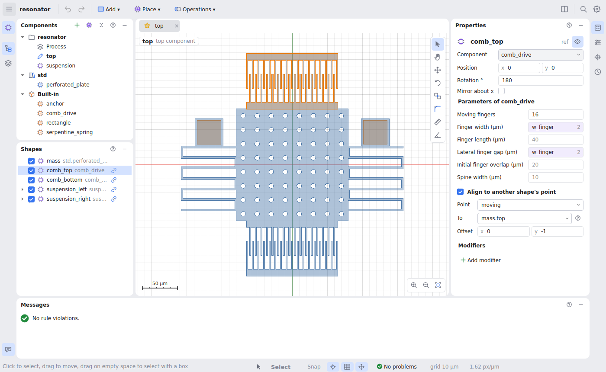

# Getting started

## Install

mems-sketch needs Python 3.11 or later.

```bash
pip install -e ".[gui]"            # the editor
pip install -e ".[gui,matlab]"     # also MATLAB .mat files
```

Start the editor with `mems-sketch`, or open a project straight away:

```bash
mems-sketch examples/resonator/project.yaml
```



## The ideas in five minutes

**Everything is a component.** The resonator above is the project's *top*
component. It places other components: a perforated plate from a library, two
comb drives and two suspensions. Each of those is a component too, with its
own parameters (the comb drive's finger count, width, gap…). Double-click one
in **Components** to open it in its own tab.

**Values are parameters and expressions.** The comb's finger width is
`w_finger`, a parameter of the top component, which itself defaults to
`process.min_gap`, a process constant. Change the constant and every finger
follows. Any number field takes an expression (`pitch * 2 + 1`); drag a
number left or right to change it and watch the canvas follow.

**Parts stay attached.** The combs are *aligned*: comb_top's `moving` point
sits on the plate's `top` point, 1 µm inside. Make the plate bigger and the
combs move with it. Nothing is positioned by hand-calculated coordinates
unless you want it to be.

**Operations don't destroy anything.** Subtracting a hole from a plate keeps
both the plate and the hole as shapes you can still edit; the subtraction is
a node in the tree. The same goes for offsets, fillets, arrays, mirrors and
rounded corners.

**The project is a folder of text files.** Each component is one small YAML
file. Changing a value changes one line, so the project lives well in git,
and the [History](history.md) panel shows what changed between versions.

## A first edit

1. Open the example (above) and select **comb_top** in **Shapes**.
2. In **Properties**, set *Moving fingers* to `12`. The comb redraws; the
   alignment keeps it on the plate.
3. Open **Parameters** (the sliders icon on the right edge) and drag the
   `plate` default from 160 to 200: the plate grows, the combs and springs
   move with it.
4. **Messages** (bottom) lists any design-rule violation, with a red box on
   the canvas; click one to go there.
5. **Undo** (Ctrl+Z) goes back step by step; **☰ → File → Save** (Ctrl+S)
   writes the project folder; **Export…** (Ctrl+E) writes GDS.

Next: [the window](the-window.md), or straight to
[components and parameters](components.md).
