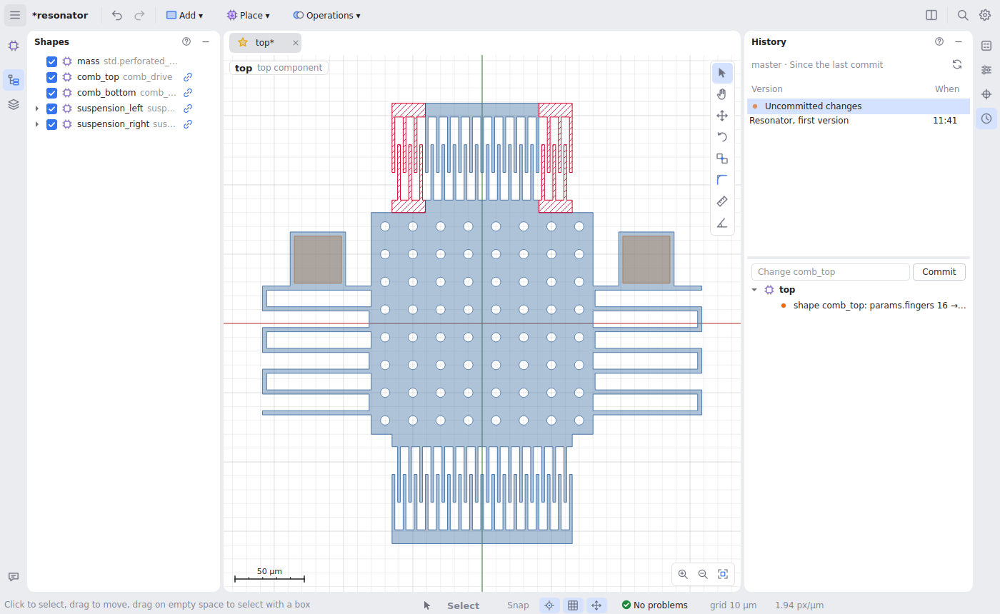

# History

For a project saved in a git repository, the **History** panel (the clock on
the right edge) shows what changed, in words and on the canvas, commits it,
and brings back earlier versions.

## What changed

The list starts with **Uncommitted changes**: the last commit against the
design as it is now, saved or not. Below it are the commits that changed the
project, newest first. Choose one to see what it changed.

- Changes are listed per component, in words: `parameter slot_x: default 45 →
  60`, `shape comb_top: params.fingers 16 → 10`, `shape anchor_2 added`,
  `layer metal added`. Click one to open its component and select the shape.
- **On the canvas**, material added is tinted green and material removed is
  hatched red, in the component you are editing (with default parameters). A
  one-number change that moves half the device shows at a glance.
- Right-click a commit and **Compare with the design now** to see everything
  since then.

## Committing

With **Uncommitted changes** chosen, type a message and press **Commit** (or
Enter). A message is suggested from the changes (`Change parameter slot_x;
add anchor_2`); leave the box empty to use it.

- The project is saved first, and **only the project's folder is committed**.
  Files you staged elsewhere in the repository stay staged and are named under
  the box.
- Git needs to know who you are, once: `git config --global user.name "Your
  Name"` and `git config --global user.email you@example.com`. The panel says
  so if it is missing.

## Restoring

Right-click a commit: **Restore the project as it was**, or **Restore
&lt;component&gt; as it was** for the one you are editing. It is an ordinary
edit: Undo takes it back, and nothing in git changes. The panel then shows
what the restore changed as uncommitted changes; commit it to keep it.

## Starting a repository

A saved project that is not in a repository gets **Initialize git here**.
Branches, merging, push and pull stay with your usual git tools; the panel's
header shows the current branch.
