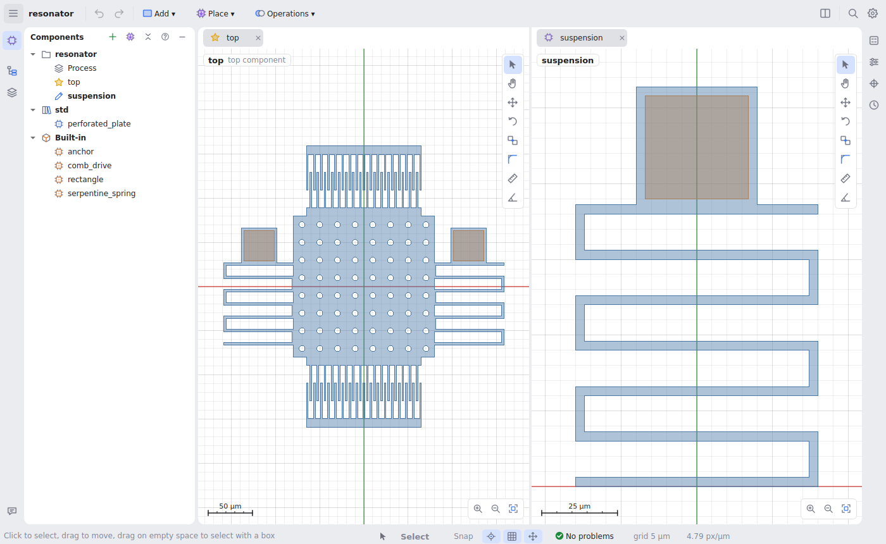
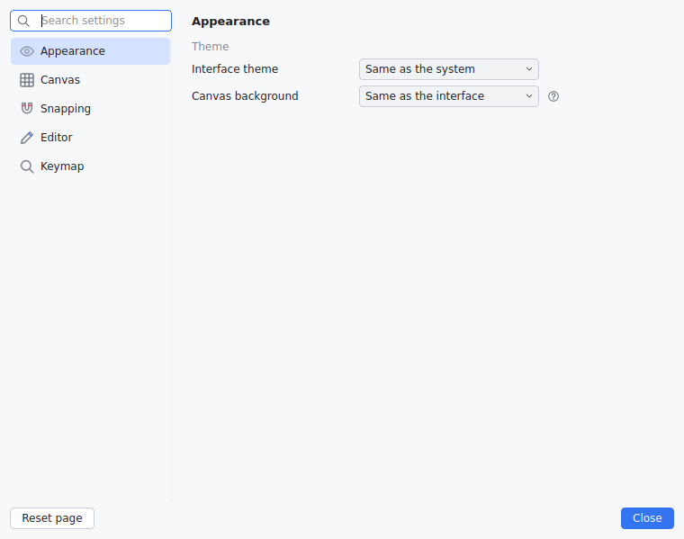

# The window

The window follows JetBrains IDEs for the editor parts (one toolbar row, tool
windows opened from the edges, tabs, settings, Find Action) and
Blender/Unity for the geometry (canvas modes, gizmos, a red x axis and a green
y axis).

## Toolbar

One row: **☰** (every menu is in it; menu paths in this guide such as
**View → Dark canvas** are inside it), the project's name, undo and redo,
then:

- **Add ▾**: primitives. Rectangle, circle, polygon and path start their
  drawing tool; an arc is added as a default one.
- **Place ▾**: components to put into the one you are editing.
- **Operations ▾**: subtract, intersect, XOR, offset, fillet, layer map,
  transform, make component.

On the right: split view, **Find Action** (Ctrl+Shift+A: type part of a
command's name, Enter runs it; Shift twice searches components, shapes and
parameters too) and settings.

## Tool windows

Panels open and close from the stripes on the window's edges:

| Where | Windows |
|---|---|
| Left stripe, top | **Components** |
| Left stripe, below | **Shapes**, **Layers** |
| Left stripe, bottom | **Messages** (runs along the bottom) |
| Right stripe | **Properties**, **Parameters**, **Points**, **History** |

Each place shows one window at a time; the left side splits when Components
and Shapes (or Layers) are both open. Every panel has a **?** in its header:
hover it for what the panel is for. The same **?** explains things in place
elsewhere (alignment, points, the process, each setting). Which windows are
open, and their sizes, are remembered. **View → Panels** lists them too.

## Tabs and split view

Every component opens in its own tab, with its own zoom, selection and view;
the panels show the current tab. Double-click a component in **Components**,
or a placed component on the canvas or in **Shapes**, to open it.

**View → Split view** (Ctrl+\\) shows two tabs side by side: edit the spring
on one side and watch the resonator that uses it on the other.

- A `*` on a tab marks a component changed since the last save; a star marks
  the top component, a lock a read-only one.
- Right-click a tab to close it, the others or all, or to open it in the
  other pane.
- Library and built-in components open **read-only** and show their
  interface, as a library does in code: the geometry, the description, the
  public parameters and the points. How they are built stays hidden
  (**View → Show implementation of read-only components** shows it).

## Status bar

The current hint, the active tool and its options (the drawing layer and path
width while drawing, the angle step for Rotate), the snapping toggles (shape
points, grid) and the gizmo toggle, then problems (click to open Messages),
grid step, zoom and cursor position.

## Settings

**☰ → File → Settings…** (Ctrl+Alt+S): appearance (light or dark, or as the
system; the canvas can keep its own background), canvas (fill opacity,
outlines, grid, overlays, gizmo size, zoom step), snapping, editor defaults
and the keymap. The search field filters them; changes apply at once and are
kept per user.

## Undo and editor state

- **Undo/redo** is one history for the whole project and goes back to the tab
  where the change was made, reopening it if it was closed.
- Every edit is checked: if it would stop the project from building
  (including components that use the edited one), it is taken back with a
  message.
- **How you were looking at the project** comes back when you reopen it: open
  tabs and the split, zoom and position per tab, selections, rulers,
  collapsed tree items, hidden layers, trial values, the drawing layer. It is
  kept in `.mems-sketch/` in the project folder, which is never committed to
  git; delete it to reset the views.
